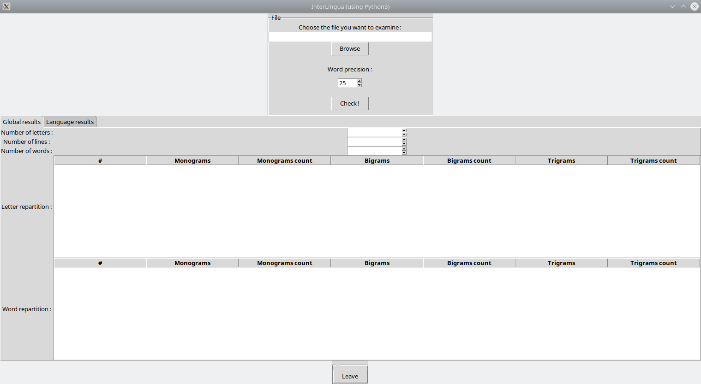

# InterLingua-python

## Presentation

### What is Interlingua ?

Interlingua is a language detection software. Feed him a text and a corpus and
it will detect the language for you.

You have a console mode for frequent usages and an interface for quick tests
and tries.

### Which languages are already supported ?

A bunch of solid corpora are already made and available for ***french and
english languages***.

Other languages are available but would gain a better detection with a more
massive corpus for them. These languages are :
- ***danish***
- ***dutch***
- ***esperanto***
- ***finnish***
- ***german***
- ***greek***
- ***hungarian***
- ***italian***
- ***portuguese***
- ***spanish***
- ***swedish***
- ***tagalog***

As you may have seen, languages detected are those using words. The reason
why is quite simple : the detection works on word frequency. So it would
be a non-sense to try detecting languages that does not have words like
***japanese, korean or chinese***. ***Arabic languages*** could be detected
but with a way worse precision while ***slavic languages using cyrillic***
would be perfectly detected.

## How to use ?

### Using the interface

Be prepared to one of the ugliest interface you have never seen. It is my
first try using [TkInter](https://wiki.python.org/moin/TkInter). In fact,
the whole project is an excuse to learn basics of TkInter.

Without further ado, let's launch our application :

```shell script
# Just launch the main script using python 3.
python 3 /path/to/project/interLingua-python/interlingua.py
```


1. Click on *browse* to choose the file you want to analyze.
1. Change the word precision if you want. If you do not know what it refers
to, keep it at 25. It is a good compromise for mostly all languages.
1. Click on *Check*. THis might take a while if you modified the corpus or
added a new one.
1. Once the job is done, you have on first tab some statistics on letters
and words of your text file. Furthermore, on the second tab (*Language
results*) you will get the divergence score (the lesser, the better) for
all languages.

### Using the console

```shell script
python3 interlingua.py path/to/file_location word_precision
```

This could return something like this :
```text
{'dutch': 0.3170127840703784, 'spanish': 0.25642877309863044, 'german': 0.3182726507790969, 'finnish': 0.3096123653227992, 'tagalog': 0.3225096244850374, 'italian': 0.267276645123702, 'french': 0.0600272856725618, 'latina': 0.29978660469794977, 'danish': 0.29665832681319904, 'swedish': 0.30652807839984436, 'greek': 0.32365178545358986, 'english': 0.32216763080492955, 'esperanto': 0.28579237178243067, 'hungarian': 0.3140447985540265, 'portuguese': 0.28467438940116757}
```

That's all !


## About the corpus

### Origin of the corpus

All texts are free and in public domain, they come from the
[Project Gutenberg](https://www.gutenberg.org/). I just had to clean them
up by deleting english legal terms and presentation.
If you feel generous, you can contribute to this project with
a [donation](https://www.gutenberg.org/). They are awesome people creating
an awesome project of making knowledge and culture free and easily
accessible. (Note : I am not related to them :D )

### Enhance the corpus

Language files are the sub-folders in ***corpus/languages/*** .

One of the corpus is not good enough for you ? You want to refine it
more ?

It is so easy. Just add (or modify/delete) your file(s) inside the
correct corpus folder and delete the *results.txt* file. The absence of
this file triggers recalculations for the entire language during next usage.
So... remember to delete it at each modification/addition/deletion of a
corpus.


### Add a complete new language

Again, adding a new language is easy. Just create a folder in
***corpus/languages/*** . The folder's name will be considered as the
language name. Put all your corpus file directly inside and it's done !

You can even add variations of existing languages because the application
keeps an agnostic behavior.

As an example, you can make a folder named english_from_XIIth_century and
place your text files from this period inside.
Another interesting example would be tweets. You can study evolution of
german language on twitter by creating a corpus of german tweets.
Etc... 

## More

You found a bug ? You have a problem/idea ? Post an issue
[here}(https://github.com/racine-p-a/InterLingua-python/issues/new).

You are good at design and would like to propose a new one ?
Post an issue or a merge request.

You added or modified the corpus and you think that would help other
people ? Merge request are welcome !